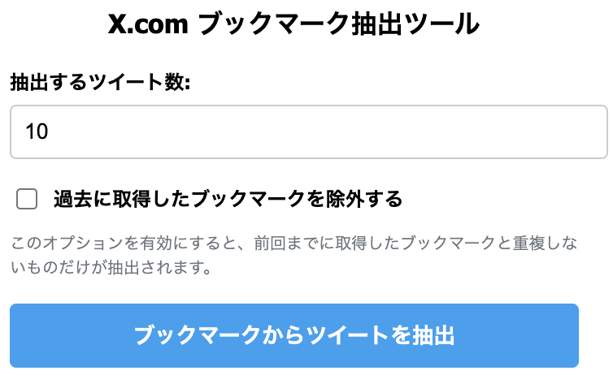

# X.com Bookmark Extractor


A Chrome extension that automatically extracts a specified number of tweets from your X.com (formerly Twitter) bookmarks page.

[日本語版README](README.md)もご利用いただけます。

## Features

- Works on X.com bookmarks page
- Automatically extracts a specified number of tweets
- Retrieves tweet content, username, and posting time
- Captures engagement metrics (replies, retweets, likes, views)
- Exports extracted data in CSV format
- Copies extracted text to clipboard

## Screenshots



## Installation

### Install from Chrome Web Store (Coming Soon)

1. Install the extension from the [Chrome Web Store](#) (link coming soon)
2. After installation, you can use it on the X.com bookmarks page

### Install Development Version

1. Download or clone this repository
   ```
   git clone https://github.com/yourusername/x-bookmark-extractor.git
   ```
2. Click on the Chrome extensions icon and select "Manage Extensions"
3. Turn on "Developer mode" in the top right
4. Click "Load unpacked extension"
5. Select the downloaded folder

## How to Use

1. Log in to X.com and open the bookmarks page (https://x.com/i/bookmarks or https://twitter.com/i/bookmarks)
2. Click on the Chrome extension icon
3. Enter the number of tweets you want to extract
4. Click the "Extract Tweets from Bookmarks" button
5. Once the extraction is complete, you can:
   - Click "Copy All" to copy the text to clipboard
   - Click "Download CSV" to save the data in CSV format

## Data Collected

This extension collects the following data:

- Tweet text
- Author name (account name)
- Posting date and time
- Number of replies
- Number of retweets
- Number of likes
- Number of views
- Tweet URL
- Links contained in the tweet

## Notes

- This extension only works on the X.com bookmarks page
- It may stop working if X.com changes its DOM structure
- Extracting a large number of tweets may take some time

## Development

If you're interested in contributing to this project, please see [CONTRIBUTING.en.md](CONTRIBUTING.en.md).

## License

This project is licensed under the MIT License - see the [LICENSE](LICENSE) file for details.

## Author

- [Your Name](https://github.com/yourusername)

## About the Icons

The extension requires icons in the following sizes:
- 16x16 pixels (icon16.png)
- 48x48 pixels (icon48.png)
- 128x128 pixels (icon128.png)

These icons are located in the `images` folder.
